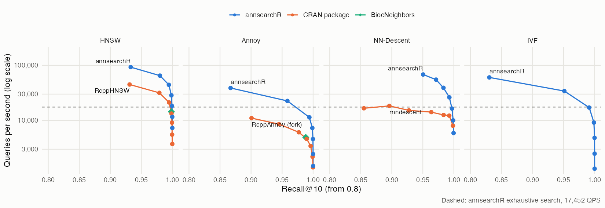
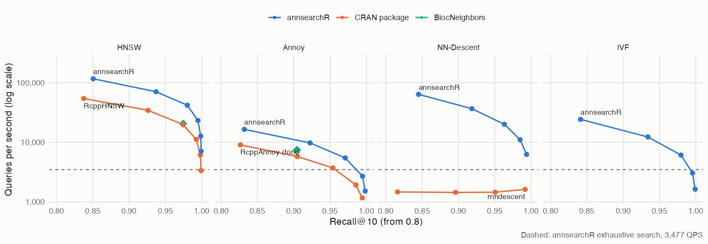
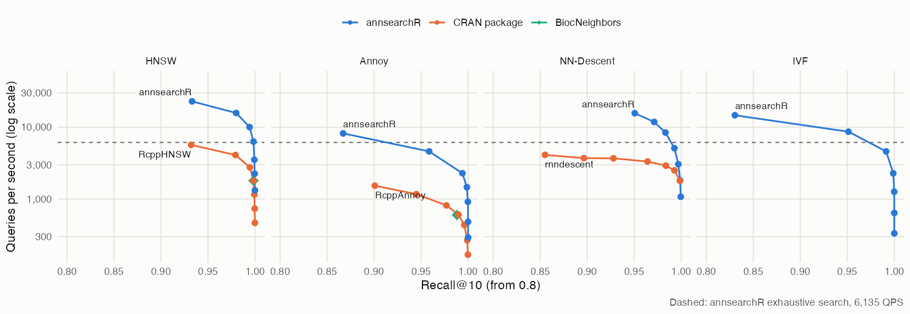

How does annsearchR stack up against the nearest neighbour packages R users
actually reach for? We ran the [ann-benchmarks](https://ann-benchmarks.com)
protocol on two of its standard datasets and compared every library at
**equal recall**, not at equal settings. Two libraries with the same `ef_search`
can land at different recall, so "faster at the same parameters" says little.
Instead each library builds once, its search-time knob is swept, and we read
off the best queries per second (QPS) it reaches at recall@10 of 0.90, 0.95 and
0.99.

These are numbers from one machine on one day, frozen here rather than rebuilt
with the package. Everything needed to rerun them is in
[`inst/benchmarks/`](https://github.com/GregorLueg/annsearchR/tree/main/inst/benchmarks).

## Setup

* **Machine:** Apple M1 Max, 10 cores (8 performance, 2 efficiency), macOS.
* **Datasets:**
  [Fashion-MNIST](https://github.com/zalandoresearch/fashion-mnist), 60,000 x
  784 (28 x 28 greyscale product photos), and SIFT-128, 1,000,000 x 128 (local
  image descriptors). Both use 10,000 held-out queries, k = 10, Euclidean
  distance and the ground truth that ships with the HDF5 files.
* **Matched build parameters:** HNSW at M = 16 and ef_construction = 200;
  Annoy at 50 trees; NN-Descent graphs of degree 30.
* **Swept at query time:** HNSW and NN-Descent `ef_search` from 10 to 640;
  Annoy `search_k` from 500 to 50,000; IVF `nprobe` from 2 to 128;
  rnndescent's `epsilon` from 0 to 0.3.
* **Libraries:** annsearchR (Rust, via ann-search-rs), RcppHNSW (hnswlib),
  RcppAnnoy (Spotify's Annoy), BiocNeighbors (KMKNN, plus hnswlib and Annoy),
  rnndescent (NN-Descent), FNN and RANN (exact kd-trees).

Each point is a single timed run over all 10,000 queries. Two repeat runs of
the Fashion-MNIST sweep agreed within about 5% for most points, but one
rnndescent point moved 1.5x between runs, so read small gaps as ties.

## Results

Each panel is one algorithm family. Up and to the right is better. The dashed
line is annsearchR's exact brute-force search: an approximate index below it
isn't worth building on that data.

### Fashion-MNIST, 10 threads



| Method | Library | Build (s) | QPS @ 0.90 | QPS @ 0.95 | QPS @ 0.99 |
|---|---|---:|---:|---:|---:|
| hnsw | **annsearchR** | 3.5 | 92,593 | 64,935 | 44,248 |
| hnsw | RcppHNSW | 8.4 | 44,843 | 31,646 | 21,186 |
| hnsw | BiocNeighbors | 66.3 | 14,347 | 14,347 | 14,347 |
| nndescent | **annsearchR** | 3.3 | 68,027 | 68,027 | 26,178 |
| nndescent | rnndescent | 15.8 | 15,221 | 14,144 | 12,210 |
| ivf | **annsearchR** | 1.4 | 34,130 | 34,130 | 17,094 |
| annoy | **annsearchR** | 1.7 | 22,573 | 22,573 | 11,364 |
| annoy | RcppAnnoy (fork) | 16.0 | 11,001 | 6,094 | 3,444 |
| annoy | BiocNeighbors | 15.6 | 4,921 | 4,921 | n/a |
| exhaustive | **annsearchR** | 0.1 | 17,452 | 17,452 | 17,452 |
| kmknn | **annsearchR** | 1.3 | 2,137 | 2,137 | 2,137 |
| kmknn | BiocNeighbors | 117.2 | 781 | 781 | 781 |
| kd_tree | RANN | - | 33 | 33 | 33 |
| kd_tree | FNN | - | 33 | 33 | 33 |

### SIFT-128, 10 threads



| Method | Library | Build (s) | QPS @ 0.90 | QPS @ 0.95 | QPS @ 0.99 |
|---|---|---:|---:|---:|---:|
| hnsw | **annsearchR** | 52.3 | 70,423 | 41,841 | 23,202 |
| hnsw | RcppHNSW | 103.4 | 34,364 | 20,000 | 11,186 |
| hnsw | BiocNeighbors | 659.9 | 20,534 | 20,534 | n/a |
| nndescent | **annsearchR** | 29.7 | 36,630 | 20,040 | 6,258 |
| nndescent | rnndescent | 207.8 | 1,621 | 1,621 | 1,621 |
| ivf | **annsearchR** | 2.5 | 12,285 | 6,105 | 3,056 |
| annoy | **annsearchR** | 10.1 | 9,766 | 5,459 | 2,695 |
| annoy | BiocNeighbors | 93.7 | 7,474 | n/a | n/a |
| annoy | RcppAnnoy (fork) | 101.5 | 5,777 | 3,716 | 1,168 |
| exhaustive | **annsearchR** | 0.4 | 3,477 | 3,477 | 3,477 |
| kmknn | **annsearchR** | 2.1 | 491 | 491 | 491 |
| kmknn | BiocNeighbors | 867.0 | 277 | 277 | 277 |
| kd_tree | FNN | - | 6 | 6 | 6 |
| kd_tree | RANN | - | 5 | 5 | 5 |

### Fashion-MNIST, 1 thread

The ann-benchmarks convention, and the fair fight for the single-threaded
RcppAnnoy, FNN and RANN.



| Method | Library | Build (s) | QPS @ 0.90 | QPS @ 0.95 | QPS @ 0.99 |
|---|---|---:|---:|---:|---:|
| hnsw | **annsearchR** | 17.8 | 22,883 | 15,773 | 10,030 |
| hnsw | RcppHNSW | 67.4 | 5,682 | 4,102 | 2,760 |
| hnsw | BiocNeighbors | 65.8 | 1,806 | 1,806 | 1,806 |
| nndescent | **annsearchR** | 15.4 | 15,674 | 15,674 | 5,102 |
| nndescent | rnndescent | 82.4 | 3,691 | 3,331 | 2,509 |
| ivf | **annsearchR** | 1.9 | 8,658 | 8,658 | 4,604 |
| annoy | **annsearchR** | 5.7 | 4,608 | 4,608 | 2,287 |
| annoy | RcppAnnoy | 15.7 | 1,534 | 817 | 436 |
| annoy | BiocNeighbors | 15.4 | 602 | 602 | n/a |
| exhaustive | **annsearchR** | 0.1 | 6,135 | 6,135 | 6,135 |
| kmknn | **annsearchR** | 1.8 | 671 | 671 | 671 |
| kmknn | BiocNeighbors | 117.2 | 100 | 100 | 100 |
| kd_tree | RANN | - | 33 | 33 | 33 |
| kd_tree | FNN | - | 32 | 32 | 32 |

## What the numbers say

* **HNSW:** annsearchR runs about 2x the queries per second of RcppHNSW at
  every recall target on both datasets with 10 threads, and builds 2 to 2.4x
  faster. Recall at the same `ef_search` is within about 0.01 of RcppHNSW's,
  so the graphs are of the same quality; the Rust search is just quicker. On
  one thread the gap widens to 3.6 to 4x: RcppHNSW gains more from extra
  threads than annsearchR does.
* **NN-Descent:** against rnndescent, 4.5x faster at recall 0.90 on
  Fashion-MNIST and 23x on SIFT, with builds 5 to 7x faster.
* **Annoy:** RcppAnnoy has no threads and no batch query, so the only way to
  use more cores from R is forking over query chunks with
  `parallel::mclapply`. That's what the "(fork)" rows are, fork cost
  included. annsearchR still does 1.5 to 3.7x the QPS and builds about 10x
  faster.
* **Exact search:** annsearchR's brute force beats every exact competitor
  by a mile: about 530x the single-threaded FNN and RANN kd-trees on
  Fashion-MNIST, and 22x BiocNeighbors' KMKNN. It also beats its own KMKNN on
  both datasets: at 784 and 128 dimensions, pruning by k-means clusters
  doesn't pay against a blocked GEMM.
* **Builds:** BiocNeighbors builds its HNSW, Annoy and KMKNN indices on one
  thread whatever `num.threads` says, which is where its 11 and 14.5 minute
  SIFT builds come from.

## Caveats

* **Brute force isn't single-core even on "1 thread".** On macOS the
  exhaustive index runs large batches through Apple Accelerate. At "1 thread"
  it worked out to roughly 577 GFLOP/s on Fashion-MNIST, far more than one
  core can do, so read its 1-thread numbers as Accelerate's. The approximate
  indices don't use that path.
* **BiocNeighbors HNSW and Annoy are single points.** Its prebuilt index bakes
  the search parameter in, so sweeping it would mean one rebuild per point. We
  matched it to the middle of the sweep instead (`ef.search = 80`,
  `search_k = 5,000`).
* **rnndescent spends its time per query, not in the search.** Its QPS stays
  flat across the whole `epsilon` sweep while recall climbs from 0.59 to 0.99
  on SIFT. A fixed cost per call is about 0.25 s, about 5% of a 10,000-query
  call; the rest is roughly 0.44 ms per query regardless of `epsilon`. Where
  exactly that goes is inside its C++ code and wasn't profiled further.
* **SIFT ground truth:** annsearchR's exhaustive search reaches recall
  0.9993 against the file's own ground truth, not 1.0000. Ties between
  integer-valued descriptors are the likely reason; nothing in the tables
  depends on it.

## Rerunning

```sh
# downloads the HDF5 files once into tools::R_user_dir("annsearchR", "cache")
Rscript inst/benchmarks/bench_ann_benchmarks.R fashion-mnist-784-euclidean 10
Rscript inst/benchmarks/bench_ann_benchmarks.R sift-128-euclidean 10

# plots from inst/benchmarks/results/*_sweep.csv
Rscript inst/benchmarks/plot_results.R
```

On SIFT the index builds alone add up to about 35 minutes on the machine above,
most of it in the single-threaded BiocNeighbors and RcppAnnoy builds.
